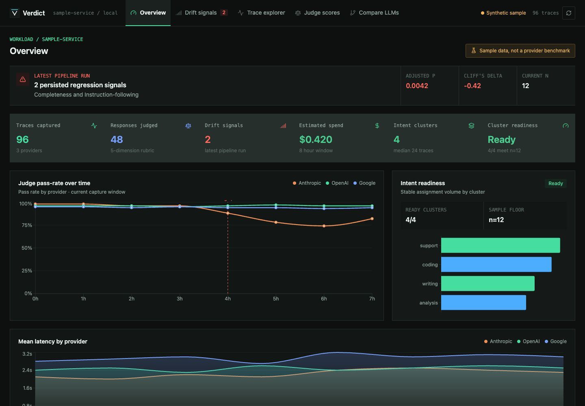

# Verdict

[](https://github.com/cognifityai/verdict/actions/workflows/test.yml)
[](https://pypi.org/project/cognifity-verdict/)
[](https://pypi.org/project/cognifity-verdict/)
[](LICENSE)

> Open-source drift detection and quality monitoring for LLM-powered apps. Helps surface behavior, estimated-cost, and response-quality changes in captured production traffic.

A [Cognifity AI](https://cognifity.ai) project. Apache 2.0.



*Bundled dashboard shown with clearly labeled synthetic sample data.*

---

## What this is

Verdict instruments supported Anthropic, OpenAI, and Google SDK methods with one line (`wrapt` monkey-patching), capturing model, tokens, latency, estimated cost, finish reason, and (opt-in) redacted content. On top of that capture it adds a monitoring stack:

- **Structural checks** (no LLM needed): refusal-rate spikes, JSON-validity drops, response-length and latency drift, hedge/apology rate.
- **Embedding drift** (no API key): MiniLM detects semantic distribution shifts; the built-in hash fallback is lexical only and is labeled as such.
- **Judge-based quality drift** (needs a provider key — see BYOK below): an LLM "judge" scores each response PASS/FAIL on a rubric; Verdict clusters prompts by intent, samples, and runs non-parametric statistics (Fisher's exact, Cliff's δ, Benjamini–Hochberg) per cluster per dimension over rolling windows, emitting a drift signal only when both the configured significance and effect-size gates clear.
- **Cross-model comparison** (Bradley–Terry) and a **synthetic regression injector** for verifying the pipeline catches known corruptions.

Verdict is **not a better judge** than the model you point it at — it *uses* that model as a measuring instrument and adds the monitoring system around it (capture → cluster → sample → judge → aggregate over time → detect drift).

**Scope (v0, honest):** Verdict measures the **individual LLM-call layer**. Agent-level metrics (tool-call patterns, plan adherence, multi-step task success) are **v1 roadmap, not shipping today** — see [`docs/v1-roadmap.md`](docs/v1-roadmap.md). Do not read v0 as agent-task evaluation.

## Runs key-free; add a key for the judge (BYOK)

Verdict never ships with anyone's API key. It reads **your** provider key from the environment — bring your own key (BYOK). Critically, most of Verdict works with **no key at all**:

| Capability | Needs a provider API key? |
|---|---|
| Capture (traces, tokens, latency, estimated cost, errors) | **No** |
| Structural checks (refusal/JSON/length/latency drift) | **No** |
| Lexical embedding drift (built-in hash fallback) | **No** |
| Semantic embedding drift (local MiniLM; extra install) | **No** |
| Intent clustering | **No** |
| Judge-based PASS/FAIL quality drift | **Yes** (your key) |
| Cross-model Bradley–Terry comparison | **Yes** (your key) |

After installation, capture and structural checks can run without a provider key. The built-in hash embedder can report lexical embedding-distribution changes, but it is not a semantic model and may split paraphrases into separate intent clusters. Install the local `sentence-transformers/all-MiniLM-L6-v2` extra shown below for semantic intent clustering and semantic drift. Capture never invokes a judge automatically. A provider-backed judge run requires that provider's key; `verdict-inspect` skips its optional Anthropic judge when no Anthropic key is set.

```bash
export ANTHROPIC_API_KEY=...     # or OPENAI_API_KEY / GOOGLE_API_KEY
```

The judge is pluggable behind a provider interface, so you can point it at Anthropic, OpenAI, Google, or a local/self-hosted OpenAI-compatible model. The default judge model is configurable; a cheap model (e.g. Haiku) is the recommended default, with a stronger model (e.g. Sonnet) as an accuracy upgrade.

## Install

**Requires Python 3.10+.** On macOS the system `/usr/bin/python3` is often 3.9 and will fail to install — use a 3.10+ interpreter (`brew install python@3.12`, `pyenv`, or `uv venv --python 3.12`).

Install the public alpha from PyPI. Choose only the provider extras you use:

```bash
pip install "cognifity-verdict[anthropic,openai,google]"
pip install "cognifity-verdict-eval[semantic]" cognifity-verdict-inspect
```

Extras for `cognifity-verdict`: `anthropic`, `openai`, `google`, `postgres`, or
`all`. Google capture specifically needs the `google` extra (`google-genai`).
The dashboard is intentionally a repo-local app; from a source checkout,
install its server dependencies with `pip install -r ui/requirements.txt`.

An unrelated project owns the `verdict` distribution on PyPI and exposes the
same top-level `verdict` import. Do not install that distribution in the same
environment as `cognifity-verdict`; overlapping Python package paths make the
combination unsafe. Cognifity's distribution name is different, while the SDK
API remains `import verdict`.

Minimal install without the local semantic model:

```bash
pip install cognifity-verdict-eval   # hash fallback only; lexical, not semantic
```

The full test suite also needs pytest and the dashboard's HTTP test dependency:

```bash
pip install pytest pytest-asyncio httpx
python -m pytest -q
```

Key-free smoke test (needs only numpy + wrapt):

```bash
python scripts/smoke_test.py
```

## Five-line install pattern

```python
import verdict
from anthropic import Anthropic

verdict.init(service_name="my-app", storage="sqlite:///./verdict.db")
client = Anthropic()
# Use Anthropic normally; supported calls are captured.
# Run scripts/run_drift_pipeline.py separately for sampling, judging, and drift.
```

Content capture is **off by default** (a PII surface). With
`verdict.init(capture_content=True)`, Verdict recursively sanitizes supported
JSON-compatible message fields, including nested tool inputs/results and OpenAI
tool arguments, before `Trace` assignment and again at storage. The detector is
best-effort pattern matching with Luhn card checks and standard-library IP
address validation, not a compliance control; names, addresses, many
international identifiers, and opaque application metadata are not guaranteed
to be found. Clock values such as `12:34:56` are not treated as IPv6. Use
non-sensitive tenant/session/cluster IDs. `sample_rate`
controls what fraction of supported calls is retained. For high-volume
production, `verdict.init(buffered_writes=True)` moves writes to a background
batched writer off the request hot path. `close()` drains every accepted write
before stopping the worker; writes and reads after close raise, while a
post-close `flush()` is an idempotent no-op.

## Validation status

Reproduce the checks yourself with the scripts here. The defensible claim is
deliberately narrow:

> **Verdict captures supported real LLM calls and runs evaluator-isolated
> PASS/FAIL drift analysis; the included workflows let each team measure judge
> agreement on its own held-out labels.**

What this repo includes:

- A synthetic regression battery for checking that the capture -> judge -> score
  path catches known injected failures (`scripts/run_regression_injection.py`).
- A multi-run validation that exercises stable cluster assignment, trace-time
  windows, the n>=30 cell floor, planted regressions, clean controls, and
  `UNCLEAR`-rate drift across 12 separate runs (`scripts/validate_multirun.py`).
- A pairwise judge-alignment harness for comparing model-ranking judgments
  against human-labeled public data (`scripts/verify_judge_alignment.py`).
- A rubric-alignment harness for measuring PASS/FAIL judge consistency against
  your own labeled traces (`scripts/verify_rubric_alignment.py`).

The shippable number for any given team is **their** held-out, human-labeled task
data measured with the same rubric-alignment harness. Treat public benchmarks as
sanity checks, not proof that a judge is calibrated for your workload.

## Judge calibration workflow

```bash
python scripts/sample_to_label.py --source sqlite --db verdict.db --dedupe-by-prompt --out raw.jsonl
python scripts/verify_rubric_alignment.py --make-template raw.jsonl labels.jsonl
python scripts/label_ui.py --file labels.jsonl          # local labeling UI, autosaves
python scripts/verify_rubric_alignment.py --labeled labels.jsonl --provider anthropic --judge-model <model>
```

You hand-label a sample PASS/FAIL (blind, before the judge runs), then the harness reports per-dimension and pooled agreement with 95 % bootstrap CIs. A threshold is "cleared" only when the **CI lower bound** clears it, not the point estimate.

## Architecture

Hexagonal / ports-and-adapters, ≥2 adapters per port (one real + in-memory for tests). Storage: `SQLiteStorage`, `PostgresStorage`, `InMemoryStorage`, plus a `BufferedStorage` wrapper for async batched writes. Judge providers: Anthropic, OpenAI, Google, optional LiteLLM, and a `FakeProvider` for tests. Capture uses a **vendor-neutral `Trace` schema** (it borrows OpenTelemetry GenAI *attribute names* but does **not** emit OTel/OpenInference spans — an exporter is a v1 roadmap item). See the ADRs in [`docs/adrs/`](docs/adrs/).

## Honest limits / not in v0

- **No OpenTelemetry/OpenInference span emission** yet (vendor-neutral schema today; exporter is planned).
- **Streaming:** Anthropic, OpenAI, and Google modern-SDK streaming are captured and confirmed against live SDKs via `scripts/live_capture_check.py`. Keep that script in the release checklist, because provider SDK stream chunk shapes can drift.
- Stream traces finalize deterministically on full iteration, an iteration
  error, explicit `close()` / `aclose()`, or context-manager exit. Async
  cancellation is recorded as an error. Dropping a never-iterated or unclosed
  stream and relying on garbage collection is not a supported persistence
  guarantee.
- **`encrypt` redaction mode** is not implemented (rejected at `init()`);
  redaction uses a linear email scanner plus regex candidates, Luhn card checks,
  and standard-library IP validation. Presidio is not used.
- **Agent-run / tool-call tracing** is v1, not built. Manual `@trace` spans *are* persisted, but multi-step agent-run stitching is not.
- A supported instrumented provider call made inside a manual span now stores
  that span's ID in `Trace.parent_span_id`. This is the sole automatic link
  direction: one manual span can contain many distinct provider calls, so no
  arbitrary provider trace is written back into `SpanRecord.trace_id`.
  Automatic correlation therefore needs no acknowledgement callback, pending
  state, or repair write, and each ended span is stored once independently of
  provider persistence. `SpanRecord.trace_id` is reserved for callers that bind
  manual-only work to an
  existing stored trace with `verdict.trace_context(trace_id)` or
  `verdict.set_context(trace_id=...)`. Missing explicit trace IDs degrade to an
  unlinked span with `verdict.link_status=trace_not_found`, rather than an orphan.
  Deletion and retention preserve old spans referenced by retained traces while
  removing expired standalone and orphan spans. SQL cleanup is transactional and
  serializes concurrent trace writers while shared-span ownership is evaluated.
  This linkage is not first-class tool-sequence or task-success evaluation.
- Judge quality depends on the model, rubric, and workload; for math/code
  correctness, use stronger judges on samples or deterministic checks.
- The default Cliff's delta gate is `0.147`. On binary PASS/FAIL dimensions that
  is a 14.7 percentage-point sensitivity floor regardless of sample size. Tune
  `--effect-size-threshold` deliberately for smaller changes.
- Intent clustering is workload-dependent. MiniLM plus a `0.50` cosine-distance
  threshold is the shipped starting point, not a universal cutoff. Review the
  dashboard's cluster-health warning and bump `--clustering-version` whenever
  you deliberately change the threshold or embedding model. The runner rejects
  a registry whose recorded threshold or embedding dimension is incompatible.
  Existing traces whose IDs are absent from the selected registry also fail
  closed: use a one-time `--recluster` after a Verdict clustering migration, or
  `--trust-existing-clusters` only for stable clusters assigned outside Verdict.
- The batch drift runner uses each captured trace's `started_at` timestamp for
  its current and baseline windows. Every successful analysis atomically stores
  one `DriftRun` marker plus its exact signal set, including an explicit
  zero-signal run. Re-running the same hourly analysis identity replaces that
  snapshot. The dashboard reads only the latest completed snapshot for the
  selected evaluator, so an old signal cannot survive a newer clean run;
  historical signals without a run identity are unavailable, not current.
  Evaluator requests are sequenced and cancelled; a failed switch explicitly
  retains and names the last confirmed snapshot, and detail selections are
  re-derived from that snapshot rather than retaining stale objects.
  Deleting an attributed signal window removes each matched completed snapshot
  as a unit so its signal count cannot become inconsistent. The runner reuses
  and aggregates at most one judgment per trace for
  one complete evaluator identity (provider, model list, rubric name/version,
  behavior-relevant config, expected dimensions, and prompt/rubric fingerprint);
  incomplete historical identities and other evaluator definitions are excluded.
  Drift signals carry the same evaluator fingerprint; historical unattributed
  signals are shown as unavailable rather than mixed with a selected evaluator.
  Optional fixed human-labeled sentinel runs monitor that fingerprint separately
  from production drift. When `--judge-sentinel-file` is supplied, the runner
  persists the aggregate and blocks production judging/drift unless the status is
  `healthy`; `degraded` and `insufficient_data` both exit with status 2. The
  health gate treats one independently judged sentinel example as one trial: an
  example passes only when every declared label matches. Its Wilson confidence
  interval and minimum floor use those exact-match examples; label-level
  agreement remains a separate diagnostic. Any sentinel execution error
  prevents a `healthy` status: too few usable examples remain
  `insufficient_data`; otherwise the result is `degraded`.
  Signals retain up to five current-window trace IDs as review evidence.
- The v0 drift runner supports one tenant scope per store and rejects mixed-
  tenant analysis. Use separate stores until tenant-scoped cluster registries
  and signals are implemented.
- `cost_usd` is a best-effort estimate from a dated static base-price table, not
  a billing source of truth. Unknown models remain unpriced; caching, special
  tiers, tools, residency, and negotiated discounts are not modeled.
- Judge execution is sequential. Judge token/cost usage, evaluation-budget
  enforcement, cache-token accounting, human-readable cluster naming, and
  automatic fragmented-cluster fusion are not implemented. Their scoped
  follow-ups are listed in [`docs/v1-roadmap.md`](docs/v1-roadmap.md).
- This is a **public alpha** release — not a hosted monitoring service and not a substitute for workload-specific calibration.
- The bundled dashboard server is a read-only **SQLite** view. The SDK also has
  a Postgres adapter, but the dashboard does not read Postgres directly.

## License

Apache 2.0 — see [LICENSE](LICENSE).

## Docs

- [`docs/STATS_PRIMER.md`](docs/STATS_PRIMER.md) — plain-language explanation of every statistical method Verdict uses (Fisher's exact, Cliff's δ, Wasserstein, PSI, Benjamini-Hochberg, Cohen's κ / Gwet's AC2, Bradley-Terry) and *why* each was chosen.
- [`docs/EXPLAINER.md`](docs/EXPLAINER.md) — how the pipeline works end to end.
- [`docs/adrs/`](docs/adrs/) — architecture decision records.
- [`docs/v1-roadmap.md`](docs/v1-roadmap.md) — known limits and follow-up work.

## Contributing

Read [`CONTRIBUTING.md`](CONTRIBUTING.md) before opening a pull request. Major
decisions are documented in [`docs/adrs/`](docs/adrs/), known limits are in
[`docs/v1-roadmap.md`](docs/v1-roadmap.md), and community expectations are in
[`CODE_OF_CONDUCT.md`](CODE_OF_CONDUCT.md).
